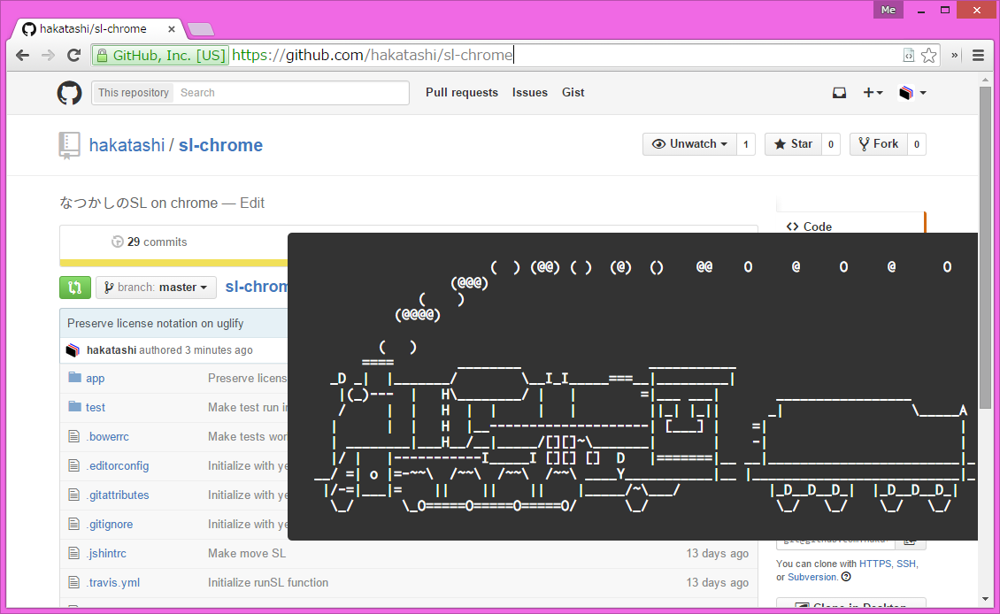
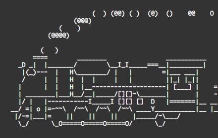

SL for Chrome
=============

Run SL run, everywhere!

Get it now: https://chrome.google.com/webstore/detail/sl/ilmjahoogaalpbjkognjcicmbajphemb

## 使い方

検索バー(omnibox)に「sl」と打ち込んでTabまたはSpaceを打ち込むとslコマンド入力モードになります。

### オプション

現在、以下のオプションが実装されています。

* `-a`, `--accident`: 事故が起こります。乗客が助けを求めてきます。
* `-F`, `--fly`: SLが銀河へ旅立ちます。
* `-l`, `--long`: 長くて小さな車体に乗り換えます。
* `-r`, `--reverse`: (独自拡張)線路を逆走します。

以下のオプションは未実装です。

* `-c`

もちろんオプションは複数指定することができます。

`sl -lrF`: 長いSLで逆走しながら銀河へ飛び立ちます。

### ライセンス

SL for Chrome はMITライセンスでライセンスされています。

&copy; 2015 Koki Takahashi

---

SL for Chrome は、豊田正史氏が制作した sl の派生プログラムです。

https://github.com/mtoyoda/sl

	Copyright 1993,1998,2014 Toyoda Masashi (mtoyoda@acm.org)

	Everyone is permitted to do anything on this program including copying,
	modifying, and improving, unless you try to pretend that you wrote it.
	i.e., the above copyright notice has to appear in all copies.
	THE AUTHOR DISCLAIMS ANY RESPONSIBILITY WITH REGARD TO THIS SOFTWARE.
